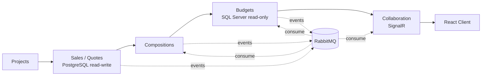
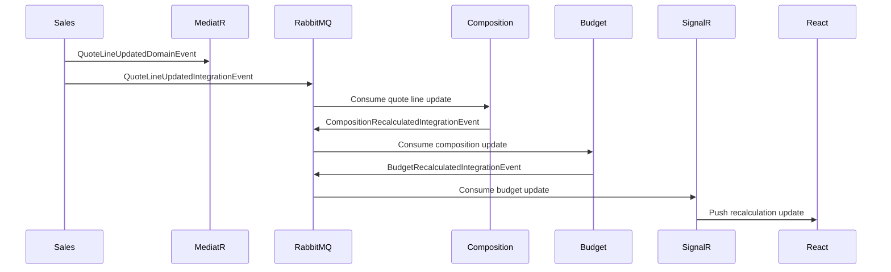

# Construction Budgeting Platform

.NET 8 and React platform for a construction project budgeting workflow. The system models project quotes, compositions, budget recalculation, margin impact, inter-module events, and real-time collaboration updates.

This repository is scoped as a focused business ERP slice, not a full ERP suite.

## Target Stack

| Area | Technology |
| --- | --- |
| Backend | .NET 8, ASP.NET Core Web API, SignalR |
| Frontend | React, TypeScript, React Query |
| Architecture | Hexagonal / Clean Architecture, DDD, CQRS |
| In-process messaging | MediatR |
| Inter-module messaging | MassTransit, RabbitMQ |
| Data stores | PostgreSQL for Sales/Vente read-write, SQL Server for Budget read-only |
| Infrastructure | Docker Compose, Kubernetes-ready service boundaries |
| Quality | Unit tests, integration tests, Testcontainers |

## Modules



## Core Workflow

```text
Project created
  -> Quote created
  -> Quote line quantity or unit price changed
  -> Composition recalculated
  -> Budget recalculated
  -> Margin impact calculated
  -> Collaboration update pushed to the React client
```

## Event Flow



## Planned Structure

```text
src/
  ConstructionBudgeting.Api
  ConstructionBudgeting.Modules.Projects
  ConstructionBudgeting.Modules.Sales
  ConstructionBudgeting.Modules.Compositions
  ConstructionBudgeting.Modules.Budgets
  ConstructionBudgeting.Modules.Collaboration
  ConstructionBudgeting.SharedKernel
  ConstructionBudgeting.Messaging

tests/
  ConstructionBudgeting.Domain.Tests
  ConstructionBudgeting.Application.Tests
  ConstructionBudgeting.Integration.Tests
```

## Implementation Plan

1. Create the .NET 8 solution and module projects.
2. Implement the Sales quote aggregate with TDD.
3. Add CQRS commands and queries through MediatR.
4. Add PostgreSQL persistence for Sales/Vente.
5. Add MassTransit and RabbitMQ integration events.
6. Add Budget read-only SQL Server adapter.
7. Add SignalR notifications for recalculation updates.
8. Add a React Query page for quote editing and live budget updates.
9. Add integration tests with Testcontainers.
