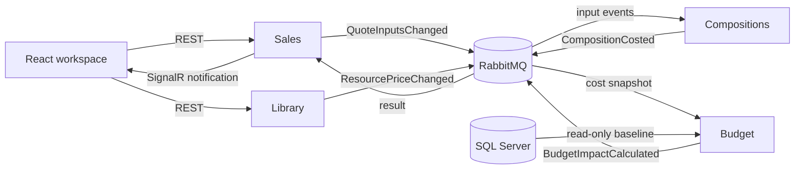

# Construction Budgeting Platform

Construction ERP services for project quotations, resource costing, budget comparison, and margin calculation. Changes to quantities and resource prices propagate between services through an event bus, with real-time updates to the quotation workspace.

**Project status:** scope and architecture documented; application implementation has not started. See the [delivery checklist](docs/TODO.md) for verified progress and the next task.

## Core workflow

1. Create a project and a draft quotation.
2. Add work items with quantities, sales prices, and material/labor compositions.
3. Change a quote quantity, sales price, or resource cost.
4. Recalculate estimated cost, compare it with the existing budget, and update margin.
5. Notify connected clients and refresh the affected quotation data.

The initial release uses EUR, tax-exclusive amounts, fixed sales prices, and linear resource consumption. Resource-cost changes affect costs and margin without automatically changing customer sales prices.

## Architecture

Four independently runnable .NET services share versioned integration contracts:

| Service | Responsibility |
| --- | --- |
| Sales / Vente | Projects, draft quotations, sales amounts, final margin view, REST API and SignalR |
| Library | Material and labor resources and their cost prices |
| Compositions | Work-item recipes, resource-price projections and quote cost calculations |
| Budget | Read existing budget baselines and calculate budget variance |

Each service keeps business rules separate from persistence, transport and API adapters. MediatR dispatches commands, queries and domain-event handlers within a process; MassTransit/RabbitMQ carries integration events between services.

## Technology

| Area | Target stack |
| --- | --- |
| Backend | .NET 8, C#, ASP.NET Core REST APIs |
| Frontend | React, TypeScript, React Query |
| Architecture | Hexagonal / Clean Architecture, DDD, CQRS |
| In-process dispatch | MediatR |
| Integration events | MassTransit, RabbitMQ |
| Persistence | EF Core, PostgreSQL, SQL Server read adapter |
| Real-time updates | SignalR |
| Local runtime | Docker, Docker Compose |
| Verification | Focused unit and integration tests; browser acceptance checks |

## Data ownership

PostgreSQL is the read/write Vente store. The `sales`, `library`, `compositions`, and `budget_projection` schemas are owned by their respective services. Services do not read or write each other's tables; cross-service updates use integration events.

SQL Server supplies the existing budget baseline through a read-only application account. Initialization scripts own baseline setup. Calculated budget variance and message-processing state belong in PostgreSQL, without updating the SQL Server baseline.

Sharing one PostgreSQL database simplifies local operation while retaining service-level ownership. It does not provide independent database availability for each service.

## Initial release boundary

The release covers draft quotations, resource cost changes, composition calculations, budget comparison, margin, single-instance SignalR, basic concurrency protection, and duplicate/stale-message handling.

Kubernetes, cloud deployment, CI/CD pipelines, authentication/authorization, Redis, service replication, approval workflows, purchasing, invoicing and automatic sales-price adjustment are outside this release. The runtime target is a local Docker Compose environment.

## Development and progress

- [Delivery checklist and current handoff](docs/TODO.md)
- [Two-week implementation plan](docs/implementation-plan.zh-CN.md)
- [Architecture and business decisions](docs/architecture-decisions.zh-CN.md)

Build and run commands will be added after the solution and Compose configuration are implemented and verified. Planned capabilities are tracked as open checklist items until validated.
