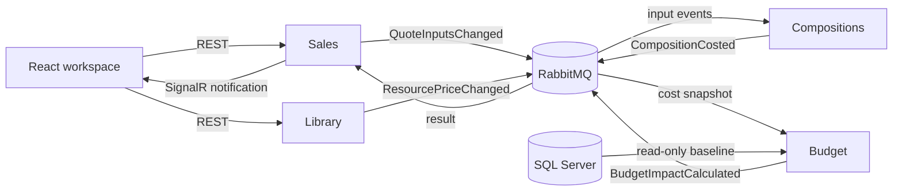

# Construction Budgeting Platform

Construction ERP services for project quotations, resource costing, budget comparison, and margin calculation. Changes to quantities and resource prices propagate between services through an event bus, with real-time updates to the quotation workspace.

**Project status:** Sales domain rules, MediatR quantity-change/query use cases, EF Core mappings and an initial PostgreSQL migration are implemented. The PostgreSQL repository reads complete ordered aggregates and atomically saves edited quotations with an expected-version check. Real database tests verify the command/query flow, competing writers and rollback after a mid-save failure. Sales now exposes quotation creation/query, line addition/removal, quantity edits and sales-price edits, with PostgreSQL persistence, HTTP 400/404/409 responses and a Development-only Swagger UI with prefilled examples. Project catalog/existence validation remains pending. Remaining service hosts, messaging and React are not yet implemented. See the [delivery checklist](docs/TODO.md) for progress and the [six implementation stages](docs/implementation-plan.zh-CN.md) for the roadmap.

## Core workflow

1. Create a project and a draft quotation.
2. Add work items with quantities, sales prices, and material/labor compositions.
3. Change a quote quantity, sales price, or resource cost.
4. Recalculate estimated cost, compare it with the existing budget, and update margin.
5. Notify connected clients and refresh the affected quotation data.

The initial release uses EUR, tax-exclusive amounts, fixed sales prices, and linear resource consumption. Resource-cost changes affect costs and margin without automatically changing customer sales prices.

## Architecture

Four independently runnable .NET services share versioned integration contracts:

| Service | Responsibility |
| --- | --- |
| Sales / Vente | Projects, draft quotations, sales amounts, final margin view, REST API and SignalR |
| Library | Material and labor resources and their cost prices |
| Compositions | Work-item recipes, resource-price projections and quote cost calculations |
| Budget | Read existing budget baselines and calculate budget variance |

Each service keeps business rules separate from persistence, transport and API adapters. MediatR dispatches commands, queries and domain-event handlers within a process; MassTransit/RabbitMQ carries integration events between services.

Sales retains its existing Clean Architecture skeleton (`Domain`, `Application`, `Infrastructure`, `Api`). Compositions is planned with explicit Hexagonal Architecture boundaries: a business core, inbound/outbound ports, and messaging/persistence adapters. Library and Budget will use simple layered structures. All services follow inward dependencies and common integration conventions; see the [architecture decisions](docs/architecture-decisions.zh-CN.md) for rationale and tradeoffs.



## Technology

| Area | Target stack |
| --- | --- |
| Backend | .NET 8, C#, ASP.NET Core REST APIs |
| Frontend | React, TypeScript, React Query |
| Architecture | Hexagonal / Clean Architecture, DDD, CQRS |
| In-process dispatch | MediatR |
| Integration events | MassTransit, RabbitMQ |
| Persistence | EF Core, PostgreSQL, SQL Server read adapter |
| Real-time updates | SignalR |
| Local runtime | Docker, Docker Compose |
| Verification | Focused unit and integration tests; browser acceptance checks |

## Data ownership

PostgreSQL is the read/write Vente store. The `sales`, `library`, `compositions`, and `budget_projection` schemas are owned by their respective services. Services do not read or write each other's tables; cross-service updates use integration events.

SQL Server supplies the existing budget baseline through a read-only application account. Initialization scripts own baseline setup. Calculated budget variance and message-processing state belong in PostgreSQL, without updating the SQL Server baseline.

Sharing one PostgreSQL database simplifies local operation while retaining service-level ownership. It does not provide independent database availability for each service.

## Initial release boundary

The release covers draft quotations, resource cost changes, composition calculations, budget comparison, margin, single-instance SignalR, basic concurrency protection, and duplicate/stale-message handling.

Kubernetes, cloud deployment, CI/CD pipelines, authentication/authorization, Redis, service replication, approval workflows, purchasing, invoicing and automatic sales-price adjustment are outside this release. The runtime target is a local Docker Compose environment.

## Development and progress

### Prerequisites

- .NET SDK 8.0.425 (pinned in `global.json`); the projects target `net8.0`.
- Docker Desktop with the Linux engine running and Docker Compose v2.
- Node 22.22.0 / npm 10.9.4 for the upcoming React application; Node is pinned in `.node-version`.

On this Windows environment the .NET 8 SDK is installed separately at `%LOCALAPPDATA%\Microsoft\dotnet`. The session helper selects it without changing the machine's existing .NET installation. A system installation matching `global.json` works as well.

PostgreSQL runs in Docker; a native PostgreSQL installation or pgAdmin is not required. A database GUI and an IDE are optional for the commands below. An existing native SQL Server installation is not used by the current Sales persistence checks.

To browse Sales tables with Windows desktop pgAdmin, register a server with host `127.0.0.1`, port `5432`, maintenance database `vente`, username `sales_app`, and the `SALES_DB_PASSWORD` value from the local `.env`. Keep the Compose `postgres` service running, then browse `vente > Schemas > sales > Tables`. A separate pgAdmin container is not needed.

For pgAdmin 4 **9.18 on Windows**, a bundled GSSAPI runtime issue can cause `access violation writing 0x0000000000000000` during connection. For this local password-based connection, add `gssencmode=disable` under Connection Parameters (keep the existing SSL setting). This workaround was verified with the installed pgAdmin Python/psycopg client against `127.0.0.1:5432/vente`; a subsequent user-provided screenshot also confirmed a successful GUI connection and quotation-table query. See [upstream issue #10428](https://github.com/pgadmin-org/pgadmin4/issues/10428).

### Start local infrastructure

From the repository root in PowerShell:

```powershell
. ./scripts/Use-Dotnet.ps1
./scripts/Initialize-LocalEnvironment.ps1
docker compose up -d --wait --wait-timeout 180 postgres sqlserver rabbitmq
docker compose run --rm sqlserver-init
./scripts/Test-Infrastructure.ps1
```

The environment initializer creates an ignored `.env` with generated local passwords and preserves an existing file. PostgreSQL initializes service schemas on its first empty-volume startup; SQL Server initialization can be run again safely. Changing `.env` does not rotate credentials already stored in database or RabbitMQ volumes.

| Component | Local endpoint | Account |
| --- | --- | --- |
| PostgreSQL / `vente` | `127.0.0.1:5432` | `sales_app`, `library_app`, `compositions_app`, `budget_projection_app` |
| SQL Server / `Budget` | `127.0.0.1:1433` | `budget_reader` (read-only) |
| RabbitMQ / `construction` vhost | `127.0.0.1:5672` | `cb_app` |
| RabbitMQ management | `http://127.0.0.1:15672` | `cb_app` |

Passwords are in the corresponding variables in `.env`; administrative credentials are used only for initialization and container checks. SQL Server uses the Developer edition for local development. Published container ports bind to localhost.

### Sales database mapping and persistence checks

For Sales-only work, start PostgreSQL without the other services:

```powershell
. ./scripts/Use-Dotnet.ps1
./scripts/Initialize-LocalEnvironment.ps1
docker compose up -d --wait --wait-timeout 60 postgres
dotnet tool restore
dotnet restore ConstructionBudgeting.sln --locked-mode
. ./scripts/Use-SalesDatabase.ps1
dotnet ef database update --project src/Services/Sales/ConstructionBudgeting.Sales.Infrastructure
./scripts/Test-SalesPersistence.ps1
```

Start Docker Desktop first if its Linux engine is stopped (`docker desktop start` is available in this environment). `Use-SalesDatabase.ps1` sets `ConnectionStrings__Sales` for the current process using the ignored `.env`, targeting `sales_app` at `127.0.0.1:5432/vente` without printing credentials. EF tooling is pinned locally in `.config/dotnet-tools.json`; no global EF installation is required.

The migration creates `sales.Quotes`, `sales.QuoteLines` and migration history. Quantities/prices use PostgreSQL `numeric` without a fixed scale; line amounts and totals retain domain rounding. The schema preserves quote-scoped line IDs, explicit line positions, EUR and the stored version, and enforces one quote per project. `EfQuoteRepository` saves existing edited quotes in one transaction, comparing the original version and replacing the complete line snapshot. Each operation owns a fresh context from `IDbContextFactory<SalesDbContext>`; The API registers this factory and repository; project existence checks remain planned. No new migration is needed for the repository.

`Test-SalesPersistence.ps1` restores/builds and runs the full suite with `SALES_PERSISTENCE_TESTS=1`. Database tests apply migrations and remove only their own randomly identified quotations. Ordinary `dotnet test` explicitly skips PostgreSQL cases unless that flag is set; the migration-model check runs without a database. The API uses the same repository for quotation creation, queries and all implemented line edits.

### Try the quotation workflow

Follow the [step-by-step Swagger and pgAdmin walkthrough](docs/sales-api-walkthrough.zh-CN.md) to use prefilled examples or create a quote from scratch, add lines, change quantities/prices, delete lines and observe stale-version conflicts. The sample initializer runs only with the explicit Development command `--seed-sample`; repeat runs preserve existing edits.

### Build, verify and run Sales

```powershell
. ./scripts/Use-Dotnet.ps1
dotnet restore ConstructionBudgeting.sln --locked-mode
dotnet build ConstructionBudgeting.sln --no-restore
dotnet test ConstructionBudgeting.sln --no-build --no-restore
. ./scripts/Use-SalesDatabase.ps1
dotnet run --no-build --project src/Services/Sales/ConstructionBudgeting.Sales.Api --launch-profile Sales
```

`GET http://127.0.0.1:5080/health` returns `200 Healthy`. This is host liveness, not database/broker readiness. The Sales host connects to PostgreSQL for quotation creation and editing and provides `/swagger` in Development. It has no message-broker integration; `Test-Infrastructure.ps1` verifies those components independently, including schema isolation and rejected SQL Server writes.

Stop the API with Ctrl+C. `docker compose stop` stops the infrastructure and retains its data. The React app and business endpoints have not been created yet.

The Sales projects enforce the inward dependency boundary: API references Application and Infrastructure; Infrastructure references Application; Application references Domain. See [Sales service boundaries](src/Services/Sales/README.md).

### Project records

- [Project context and working agreements](docs/CONTEXT.md)
- [Delivery checklist and current handoff](docs/TODO.md)
- [Two-week implementation plan](docs/implementation-plan.zh-CN.md)
- [Architecture and business decisions](docs/architecture-decisions.zh-CN.md)

Planned capabilities are tracked as open checklist items until validated. NuGet dependency graphs are committed in `packages.lock.json`; framework packages and container images are version-pinned.
