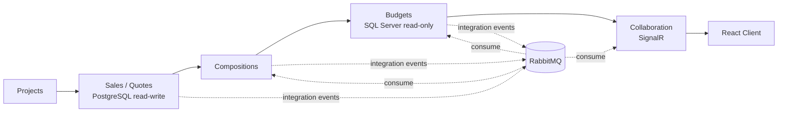
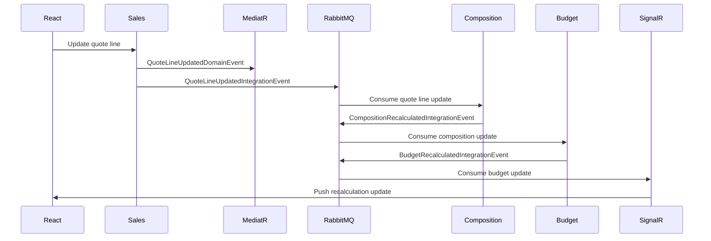

# Construction Budgeting Platform

.NET 8 and React platform for a focused construction ERP budgeting workflow. The project is designed to connect the main technical stack used in a domain-heavy business application: Hexagonal / Clean Architecture, DDD, CQRS, MediatR, MassTransit, RabbitMQ, PostgreSQL, SQL Server, SignalR, React, TypeScript, and React Query.

This is not a full ERP suite. The scope is a realistic ERP slice around project quotes, work compositions, budget recalculation, margin impact, and real-time collaboration.

## Business Scope

The reference scenario is a construction project quote, such as an office renovation. A user updates the quantity or unit price of a quote line, and the system propagates the impact through compositions, budget, margin, and the client-facing quote.

Core business concepts:

| Concept | Meaning |
| --- | --- |
| Project | The business container for a construction job |
| Quote / Devis | The price proposal shown to the customer |
| Quote line | A priced work item, such as painting or flooring |
| Composition | The labor, material, equipment, and supplier cost breakdown behind a quote line |
| Budget | Internal cost planning and control |
| Cost | Expected internal expense |
| Margin | Difference between customer price and internal cost |
| Collaboration | Real-time updates for users working on the same project data |

## Target Stack

| Area | Technology |
| --- | --- |
| Backend | .NET 8, ASP.NET Core Web API |
| Frontend | React, TypeScript, React Query |
| Architecture | Hexagonal / Clean Architecture, Domain-Driven Design, CQRS |
| In-process messaging | MediatR commands, queries, and domain events |
| Inter-module messaging | MassTransit with RabbitMQ |
| Sales/Vente store | PostgreSQL read-write database |
| Budget store | SQL Server read-only database |
| Real-time communication | SignalR / WebSockets |
| Quality | Unit tests and integration tests |

## Architecture Approach

Each module follows the same dependency rule: domain and use cases stay inside the module, while API, persistence, messaging, and real-time infrastructure stay outside behind ports and adapters.

DDD depth depends on business complexity:

| Module | Architecture focus |
| --- | --- |
| Sales / Quotes | Full DDD model: aggregate, entities, value objects, domain events, CQRS use cases |
| Compositions | Business recalculation rules triggered by integration events |
| Budgets | Read-only budget store, budget impact calculation, margin view |
| Collaboration | Lightweight domain focused on real-time delivery through SignalR |

## Modules



## Main Workflow

```text
Project created
  -> Quote created
  -> Quote line quantity or unit price changed
  -> Sales module saves the change to PostgreSQL
  -> MediatR publishes an in-process domain event
  -> MassTransit publishes an integration event through RabbitMQ
  -> Composition module recalculates work item cost
  -> Budget module reads SQL Server budget data and recalculates budget impact
  -> Margin is updated
  -> SignalR pushes the update to the React client
```

## Event Flow



## Planned Structure

```text
src/
  ConstructionBudgeting.Api
  ConstructionBudgeting.Modules.Projects
  ConstructionBudgeting.Modules.Sales
  ConstructionBudgeting.Modules.Compositions
  ConstructionBudgeting.Modules.Budgets
  ConstructionBudgeting.Modules.Collaboration
  ConstructionBudgeting.SharedKernel
  ConstructionBudgeting.Messaging

tests/
  ConstructionBudgeting.Domain.Tests
  ConstructionBudgeting.Application.Tests
  ConstructionBudgeting.Integration.Tests
```

## Delivery Plan

1. Create the .NET 8 solution, module projects, and React app.
2. Model the Sales quote aggregate with TDD: `Quote`, `QuoteLine`, `Money`, `Quantity`.
3. Add CQRS use cases through MediatR: create quote, add quote line, update quote line, get quote.
4. Add PostgreSQL persistence for the Sales/Vente read-write store.
5. Add MassTransit and RabbitMQ for inter-module integration events.
6. Add Composition recalculation after quote line changes.
7. Add Budget recalculation using SQL Server as a read-only Budget store.
8. Add margin impact calculation.
9. Add SignalR updates and a React Query page for quote editing and live budget display.
10. Add focused unit and integration tests for the business workflow.

## Current Focus

The first implementation goal is to connect the main stack end to end:

```text
React -> Web API -> CQRS/MediatR -> DDD aggregate -> PostgreSQL
  -> MassTransit/RabbitMQ -> Budget module -> SQL Server read-only
  -> SignalR -> React
```

Advanced infrastructure patterns such as authentication, outbox, idempotent consumers, Kubernetes deployment, and CI/CD can be added later if needed. They are not part of the first learning path.
